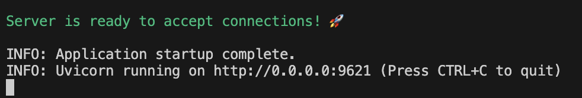
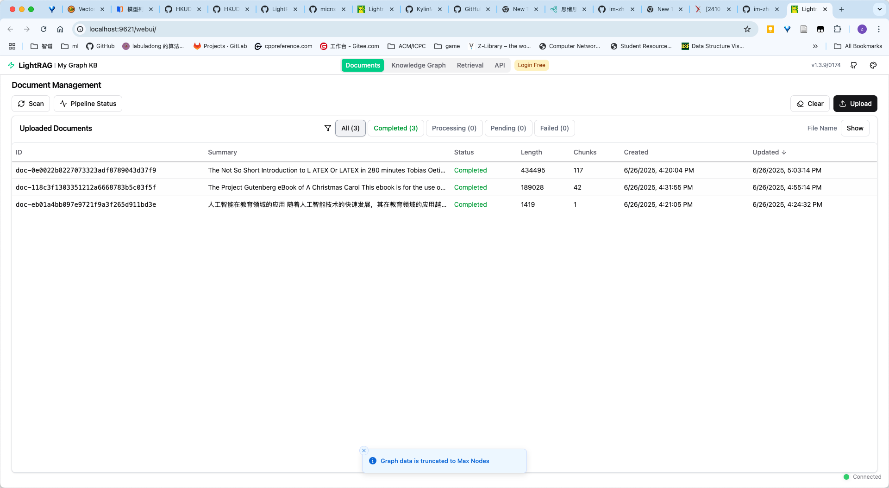

# LangChain Tutorials & RAG

## How to deploy LightRAG server on your local machine?

1. first clone this repo: `git clone https://github.com/im-zhong/langchain-tutorials.git`
2. install all the dependencies: `uv sync`
3. create the `.env` file to config the LightRAG server.
4. start the LightRAG server: `uv run lightrag-server`, you will see something like this: 
5. open your browser and check: `http://localhost:9621`, you will see something like this: 
6. have fun with it!
